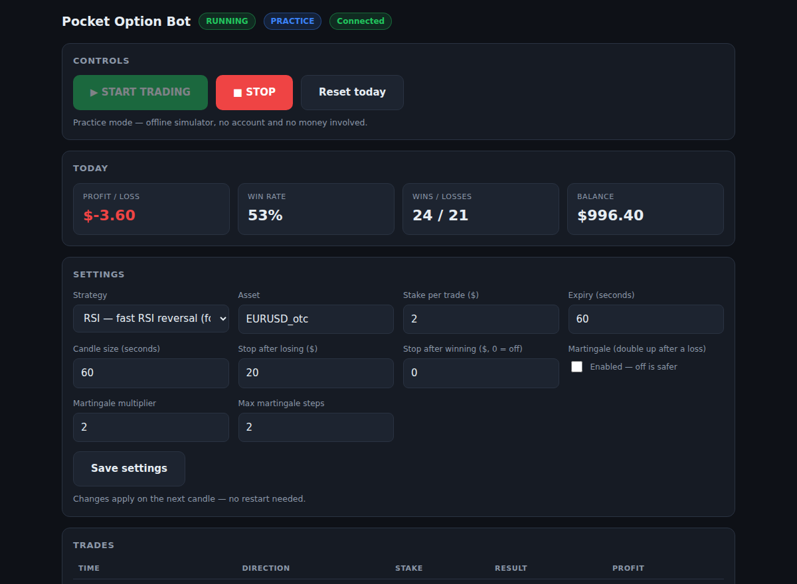
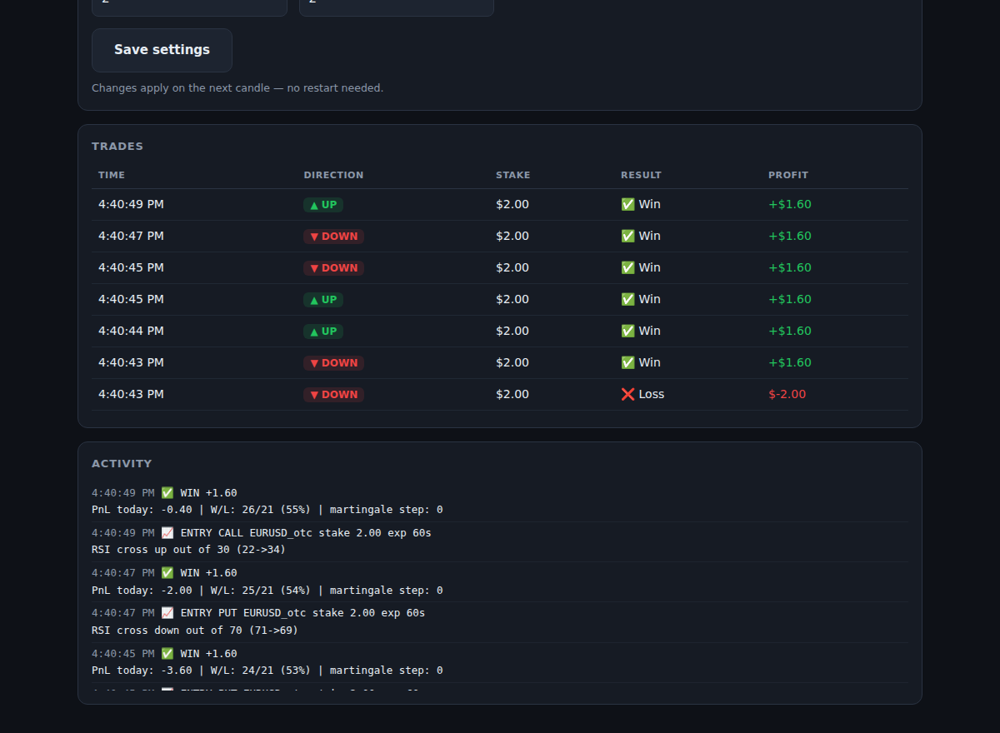
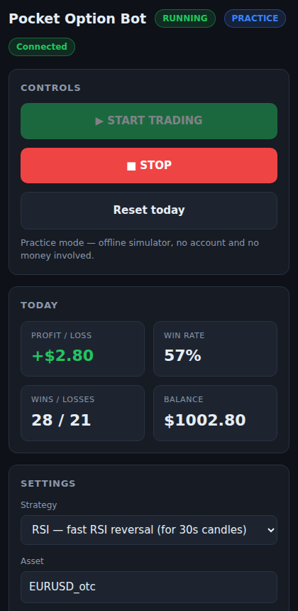

# Pocket Option Trading Bot

Automated binary-options trading on Pocket Option, controllable from a **browser
control panel** or from **Telegram** — your choice, neither is required by the
other. Eight switchable strategies, configurable expiry from 30s up to 1h, and
every parameter — stake, expiry, indicators, martingale, risk caps, start/stop —
adjustable live without a restart.



> **Please read first.** Pocket Option has no official API; this bot connects
> over their WebSocket using your browser session token (SSID), which is against
> Pocket Option's Terms of Service and can break if they change their protocol.
> **Always run on the DEMO balance first.** No trading bot can guarantee a high
> win rate — binary options are high-risk. Backtests help you *compare settings*,
> they are **not** a profit promise. Use money you can afford to lose.

---

## Features

- **Direct execution** on Pocket Option (binary CALL/PUT).
- **Browser control panel** (no install, no accounts): START/STOP, live PnL,
  win rate, balance, all settings, and a live trade list. Works on a laptop,
  Chromebook or phone. Optional password.
- **Eight strategies, switchable live**: `confluence` (trade only when several
  setups agree), `custom` (ZigZag + Stochastic + Keltner), `alligator`
  (Bill Williams + RSI), `rsi` (fast RSI reversal, built for 30s candles),
  `pullback` (EMA trend + RSI/Stochastic dip), plus three pure-trend modes —
  `linreg`, `ema`, `donchian`. All thresholds tunable.
- **Drop-in strategies**: put a `.py` file in `strategies/` and it appears in the
  panel's dropdown by itself — no code to edit, no restart. One function,
  `evaluate(candles)`. See [strategies/README.md](strategies/README.md).
- **Connect from the panel**: paste your Pocket Option session cookie into the
  page and press Save. It validates the paste, writes `.env` for you (mode 600)
  and reconnects with no restart — no hidden files, no text editor, no terminal.
- **A real-money guard**: on a funded account the panel shows a standing warning
  and START asks once, with the break-even maths on screen at the moment of the
  decision. Demo and practice are one press, as before.
- **Telegram control (optional)**: `/start` `/stop` `/status`, quick setters (`/stake`, `/expiry`, `/asset`), martingale & risk commands, a generic `/set field value`, plus inline Start/Stop/Status buttons.
- **Instant notifications** on every entry, result, error and reconnect.
- **Money management**: base stake, optional martingale (multiplier + max steps), daily loss cap and daily profit target.
- **24/7 operation** with auto-reconnect and exponential backoff.
- **Backtester + offline paper mode** so you can test the whole pipeline with no account and no credentials.
- **Unit-tested** indicators, strategy and risk logic.

## Project layout

```
pocket_bot/
├── main.py                    # entrypoint (trader + control interfaces)
├── scan_assets.py             # live payouts + the win rate each one demands
├── demo_run.py                # offline console demo of the live loop (no account)
├── backtest.py                # backtest on synthetic data or your own CSV
├── *_backtest.py              # per-strategy backtests on real EUR/USD data
├── core/
│   ├── config.py              # all settings (env + live-editable)
│   ├── indicators.py          # EMA / RSI / Stochastic (pure, tested)
│   ├── strategy.py            # trend + pullback signal logic
│   ├── trend_strategy.py      # linreg / ema / donchian trend modes
│   ├── custom_strategy.py     # ZigZag + Stochastic + Keltner
│   ├── alligator_strategy.py  # Bill Williams Alligator + RSI
│   ├── rsi_strategy.py        # fast RSI reversal (30s candles)
│   ├── confluence_strategy.py # trade only when strategies agree
│   ├── assets.py              # live asset/payout table (read-only)
│   ├── ssid.py                # session-token parsing + friendly errors
│   ├── risk.py                # stake sizing, martingale, daily caps
│   ├── broker.py              # broker interface + offline PaperBroker
│   ├── po_broker.py           # real Pocket Option WebSocket broker
│   ├── trader.py              # main async orchestration loop
│   ├── web_ui.py              # browser control panel (no dependencies)
│   └── telegram_bot.py        # Telegram command interface (optional)
├── tests/                     # pytest unit tests
├── requirements.txt
└── .env.example
```

## Quick start

```bash
bash install.sh          # installs everything, once
bash run.sh --paper      # practice mode — no account needed
```

Then open <http://localhost:8080> and press START.

To update later:

```bash
bash update.sh           # pull the latest, then bash run.sh
```

> **On Linux and Chromebooks there is no `python` command — only `python3`** —
> and the dependencies live in `.venv`, not system-wide. `run.sh` finds the
> right interpreter itself, which is why every instruction here uses it rather
> than calling Python directly. If you prefer to do it by hand, the working
> incantation is `./.venv/bin/python main.py --paper`.

<details>
<summary>Manual setup, if you would rather not use the scripts</summary>

```bash
python3 -m venv .venv                        # Windows: py -m venv .venv
./.venv/bin/python -m pip install -r requirements.txt
cp .env.example .env                         # then edit .env

./.venv/bin/python main.py --paper           # 1) simulator + control panel
./.venv/bin/python backtest.py               # 2) compare strategy settings
./.venv/bin/python main.py                   # 3) demo/live (after .env)
```

On Windows the interpreter is `.venv\Scripts\python.exe` instead.
</details>

Full setup — the control panel, the optional Telegram bot, getting your Pocket
Option SSID, and running 24/7 on a VPS — is in **[docs/SETUP.md](docs/SETUP.md)**.

## Control panel

| | |
|---|---|
|  |  |

Every trade is listed with direction, stake, result and profit, and the activity
feed shows exactly why each entry was taken. Settings apply on the next candle —
no restart. Set `WEB_PASSWORD` in `.env` before exposing the panel on a VPS.

## Pick the pair before you pick the strategy

```bash
./.venv/bin/python scan_assets.py
```

Payout decides the win rate you need just to break even:
`break-even = 100 / (100 + payout)`.

| Payout | Win rate needed to break even |
|---|---|
| 92% | 52.1% |
| 85% | 54.1% |
| 68% | 59.5% |

The same strategy, on the same signals, is profitable on a 92% pair and losing
on a 68% one. `scan_assets.py` lists every asset's live payout, whether it is
open, and the expiries it offers, then names the best-paying open pair. Payouts
move through the day — re-run it before a session. It is read-only (chart
socket), so it can never touch your balance.

## Telegram commands (optional)

| Command | Action |
|---|---|
| `/start` `/stop` | start / pause trading |
| `/status` | show all settings + today's PnL |
| `/stake <amount>` | set base stake |
| `/expiry <seconds>` | set expiry (e.g. `180` = 3m) |
| `/asset <symbol>` | set asset (e.g. `EURUSD_otc`) |
| `/strategy pullback\|linreg\|ema\|donchian\|custom\|alligator\|rsi\|confluence` | switch entry model |
| `/martingale on\|off [mult] [maxsteps]` | martingale controls |
| `/risk <loss_cap> [profit_target]` | daily caps |
| `/set <field.path> <value>` | change any setting, e.g. `/set strategy.rsi_oversold 25` |
| `/reset` | reset today's PnL + martingale |
| `/help` | list commands |

## Watch it first

`docs/panel_walkthrough.mp4` is a 95-second tour of the panel: the strategy
list, live payouts, START, the "Watching" line, and where the break-even figure
appears. No sound — it is captioned.

## Connecting your account

Step by step, including where the session token lives and why `PO_DEMO=true`
should stay `true` for now: [docs/GO_LIVE.md](docs/GO_LIVE.md).

## Before risking money

[docs/RESULTS.md](docs/RESULTS.md) — 28 strategy/timeframe combinations measured
against real EUR/USD history. None of them showed a statistically real edge, and
that includes a 70% figure quoted earlier that turned out to be 11 trades. Read
it before switching `PO_DEMO` to `false`.

## Tests

```bash
pip install pytest
python -m pytest tests/ -q
```
